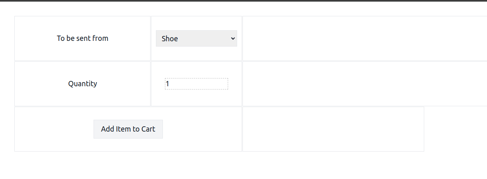

## Introduction
This repository is written to test candidate's skills when it comes to writing clean and maintainable code base. In the real world, we rarely get the chance to develop our code base from scratch and most often we have to deal with the code which is either legacy or not ours. In order to write this repository, we wrote a simple tax calculator which was used to calculate the taxes you had to pay on your income. Then we remove the parts we didn't need and wrote a simple shopping cart manager. 

## What is expected?
We expect the candidates to refactor the code to best their abilities to make the code cleaner, testable and maintainable. To what extend the candidates want to refactor the code base is up to them but the functionality of the application **MUST REMAIN THE SAME**. The candidate is allowed to change the code base however it's needed. 

* Clone the repository
* Make small changes, commit
* Repeat
* The finished work should include all the git commits whether in a repository or zip file


## How to run the application?
First you need docker to build the dependencies. You can skip this part if you already have mysql on your system. All you need to do it changing MySQL credentials in `pkg/db/get_db.go`
```
docker-compose-run:
```

Once the containers are up and ready, you can run the application:

* In prod, for this .env.prod file needs to be populated with the env variables then run
```
run-prod-env
```

* In local or to test, for this .env.test file needs to be populated with the env variables then run
```
run-test-env
```

This will run the application and a simple web server will start listening on provided port

* When using test env, it will use port`8088`. By opening the http://localhost:8088/ in your browser you should be able to see the application. 


## What it does?
The application has three simple routes:
 * Show the form to add/remove products from cart
 * Add products to your cart
 * Remove carts from your cart  

 ## How we will evaluate?
 * Is the new code cleaner? 
 * Does it have tests? What kind of test?
 * If we want to extend it, how easy or hard it is?
 * Are there any security flaws? Any major performance issues? 
 * Does it work the same as before?

## Makefile Commands

### Initialize Project

```bash
make init
```

Downloads Go module dependencies.

### Run in Production Environment

```bash
make run-prod-env
```

Runs the application using production environment variables.

### Run in Test Environment

```bash
make run-test-env
```

Runs the application using test environment variables.

### Clean Up Go Module

```bash
make tidy
```

Cleans up the Go module.

### Format Go Code

```bash
make fmt
```

Formats the Go code.

### Vet Go Code

```bash
make vet
```

Examines Go source code and reports suspicious constructs.

### Install Moq Tool

```bash
make tool-moq
```

Installs the `moq` tool for generating mocks.

### Generate Mocks

```bash
make moq
```

Generates mocks for specified interfaces.

### Run Unit Tests

```bash
make test
```

Runs unit tests.

### Run Tests with Race Condition Detection

```bash
make test-race
```

Runs tests with race condition detection.

### Clean Test Cache

```bash
make clean-test-cache
```

Cleans the test cache.

### Clean Module Cache

```bash
make clean-mod-cache
```

Cleans the module cache.

### Start Docker Compose

```bash
make docker-compose-run
```

Starts Docker containers defined in `docker-compose.yml`.

### Stop Docker Compose

```bash
make docker-compose-down
```

Stops Docker containers defined in `docker-compose.yml`.

---
